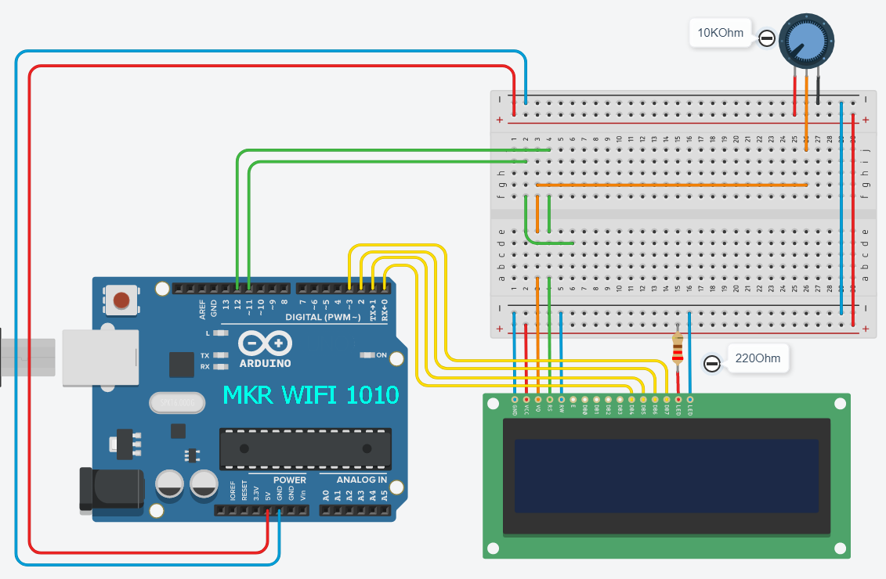
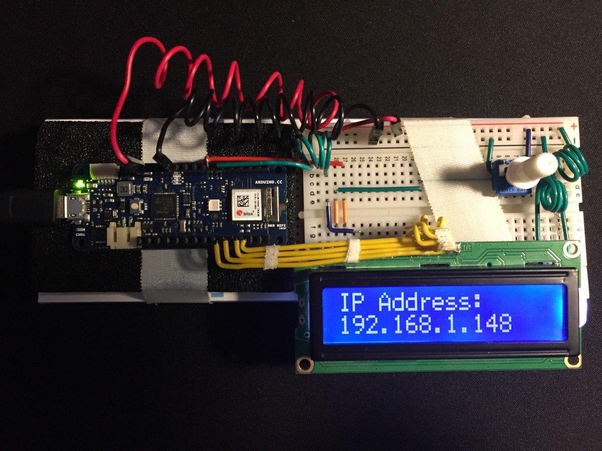
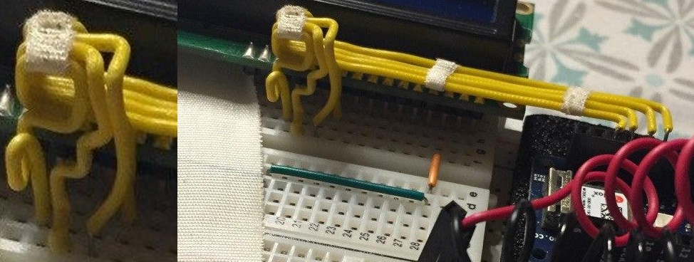
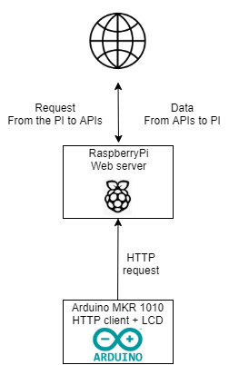
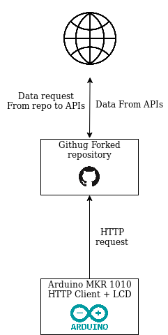

# linkeDisplay
Is network connected LCD display.

Depending on the mode that you chose, you may display differents informations.

- [linkeDisplay](#linkedisplay)
- [Getting started](#Getting-started)
  - [Physical part](##Physical-part)
  - [Software part](##Software-part)
- [Operation](#Operation)
  - [summary](##summary)
- [Example](#Example)

>**caution:**
>
>This system is currently in the development phase, 
>the code is not optimized, 
>it is ugly and contains some really unpleasant things,
>>with love, by me.

# Getting started
This project is divided into two sub-parts, a physical part, the arduino assembly, and a software part, the software for the arduino and the intermediary for the requests (here it will be the github repository).

## Physical part
First, you need to configure the Arduino system. Connect the LCD screen to your arduino wifi according to this assembly.

What you will need :
- Arduino wifi
- 220 Ohm resistor
- Potentiometer 10K Ohm
- LCD 16*2

The scheme :

## Software part

# Example

*When the system is connected, he display his ip.*

*some incredibe cable management :joy:*

# Operation

## operating mode n°1 :

The **arduino** is connected to the **PI** and display the infomation given by a script hosted on the Raspberry. The **PI** is tiny local web server, and request data from online APIs, sutch as meteo, coronavirus statistics, notification for new tweet, and more.

*simplified operating diagram*

## operating mode n°2 :
The **arduino** is directly connected to the internet and sends quests then processes and displays data directly, which avoids using the **PI**.

## summary

|  Operating mode n°1 | Operating mode n°2  | Operating mode n°3 |
|---------------------|---------------------|--------------------|
| **Arduino** and **pi**|**Arduino** and **github repo**|**Arduino** only|
||||
