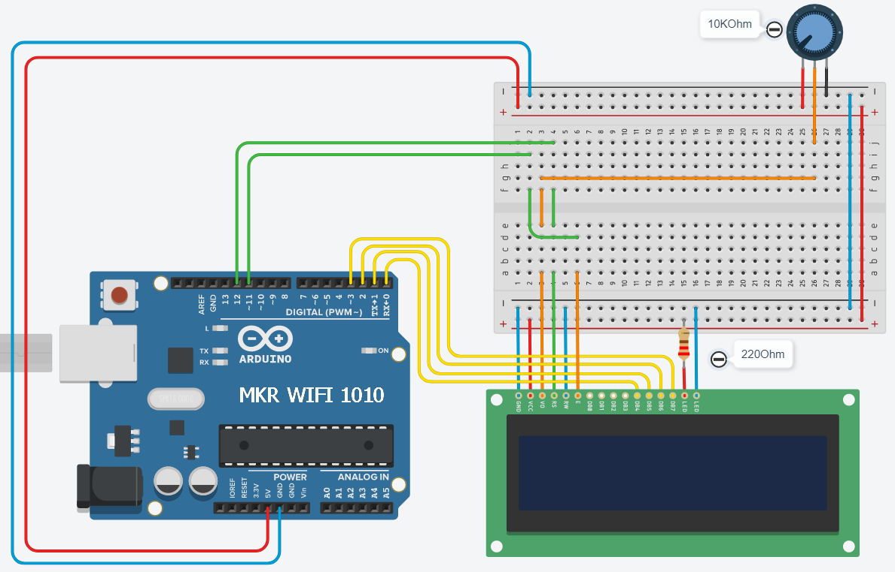

# linkeDisplay
Is network connected LCD display.

Depending on the mode that you chose, you may display differents informations.

- [linkeDisplay](#linkedisplay)
    - [operating mode n°1](#operating-mode-n%c2%b01)
    - [operating mode n°2](#operating-mode-n%c2%b02)
  - [Installation](#installation)
  - [How to use](#how-to-use)
  - [Quick Start](#quick-start)
  - [Exemple](#exemple)

>**caution:**
>
>This system is currently in the development phase, 
>the code is not optimized, 
>it is ugly and contains some really unpleasant things,
>>with love, by me.

### operating mode n°1 :

The **arduino** is connected to the **PI** and display the infomation given by a script hosted on the Raspberry. The **PI** is tiny local web server, and request data from online APIs, sutch as meteo, coronavirus statistics, notification for new tweet, and more.

*simplified operating diagram*

### operating mode n°2 :
The **arduino** is directly connected to the internet and sends quests then processes and displays data directly, which avoids using the **PI**.

## Installation :
What you will need :
- Arduino wifi
- 220 Ohm resistor
- Potentiometer 10K Ohm
- LCD 16*2

The scheme :

## How to use :
## Quick Start :
## Exemple :

*When the system is connected, he display his ip.*

*some incredibe cable management :joy:*